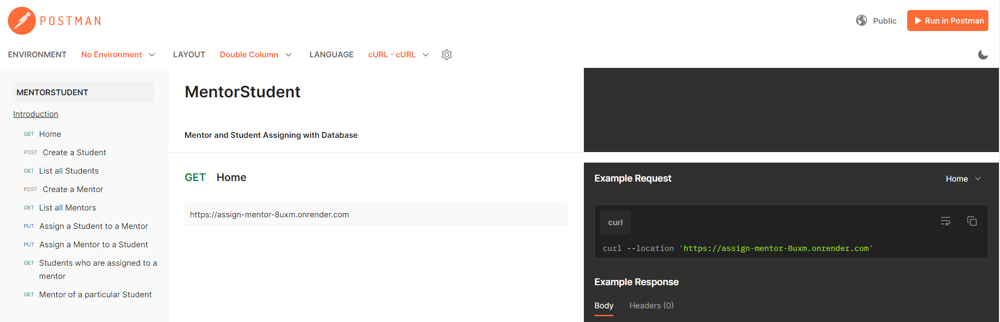

# Project Title

Assigning Mentor and Student with DB

## App deployed in Render

https://assign-mentor-8uxm.onrender.com

## Documentation

Using Express, MongoDB and node this app can help assign mentor and students.

# 💻 Tech Stack:

## Demo

Test using Postman:

- Check Home Page - GET (https://assign-mentor-8uxm.onrender.com)
- Create a Student - POST (https://assign-mentor-8uxm.onrender.com/create-student)
- List all Students - GET (https://assign-mentor-8uxm.onrender.com/students)
- Create a Mentor - POST (https://assign-mentor-8uxm.onrender.com/create-mentor)
- List all Mentors - GET (https://assign-mentor-8uxm.onrender.com/mentors)
- Assign a Student to a Mentor - PUT (https://assign-mentor-8uxm.onrender.com/assign-students-to-mentor/668fed5e5e30d2ebc1cfa089)
- Assign a Mentor to a Student - PUT (https://assign-mentor-8uxm.onrender.com/assign-mentor-to-student/668ff2182f12cb6a9d1f8010)
- Students who are assigned to a mentor - GET (https://assign-mentor-8uxm.onrender.com/mentor-students/668fed5e5e30d2ebc1cfa089)
- Mentor of a particular Student - GET (https://assign-mentor-8uxm.onrender.com/student-mentor/668ff2062f12cb6a9d1f800e)

## API documentation

https://documenter.getpostman.com/view/36588127/2sA3kSn3Lj

## Screenshot

## Installation

To run this app location follow the below steps.

- Clone this repository
- Install dependencies using npm install
- Start the development server with npm start
- Using postman test the API endpoints(if you face any issues accessing the Render deployment URL then you can use "http://localhost:5001/" instead of render deployment URL)
